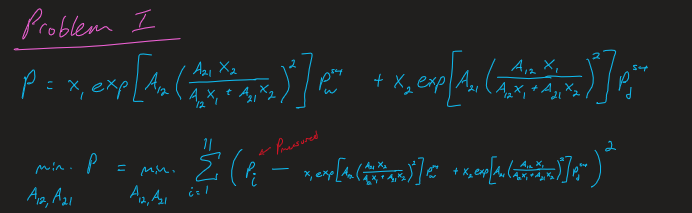

# **Homework III**

Author: Joseph D. Galloway II  
Course: Design Optimization (ME 598)

# Problem I

# Problem II
x1 = -0.11258500837345942  
x2 = 0.6967170241696405  
f(x1, x2) = 1.0272241397879296
