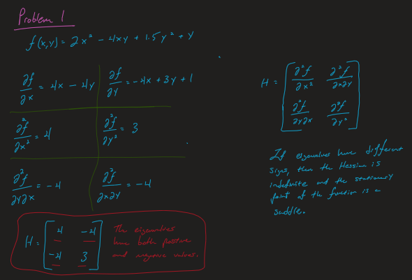
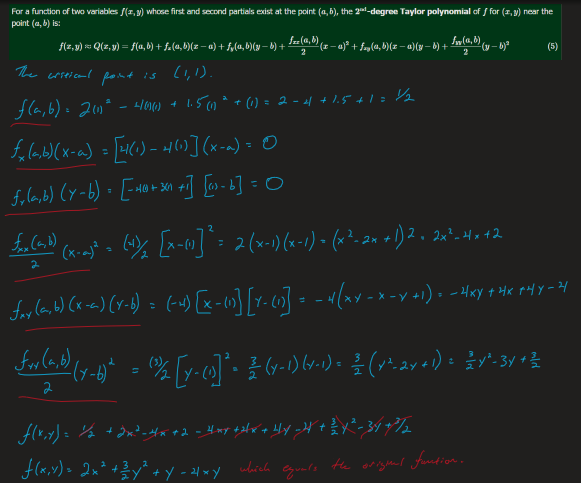
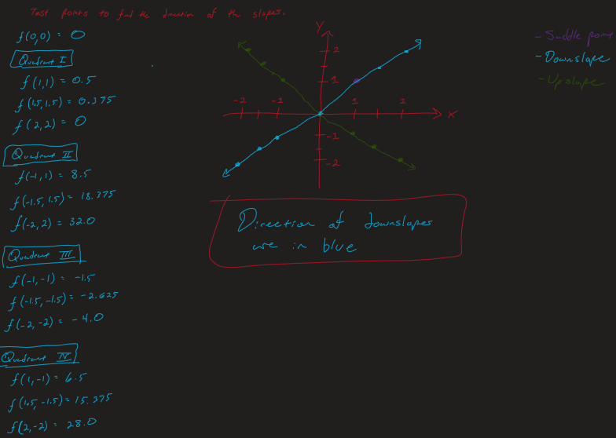
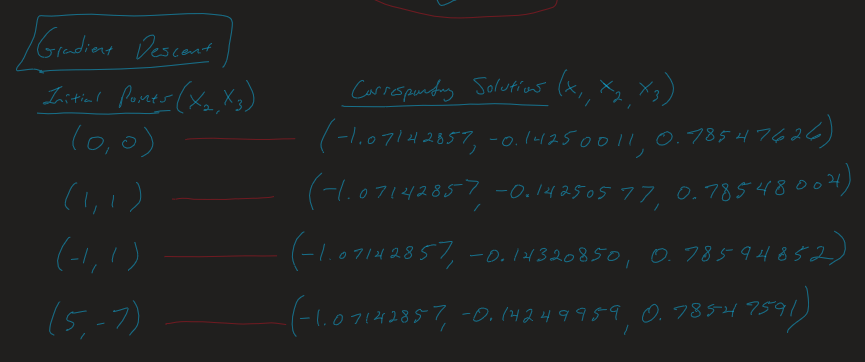
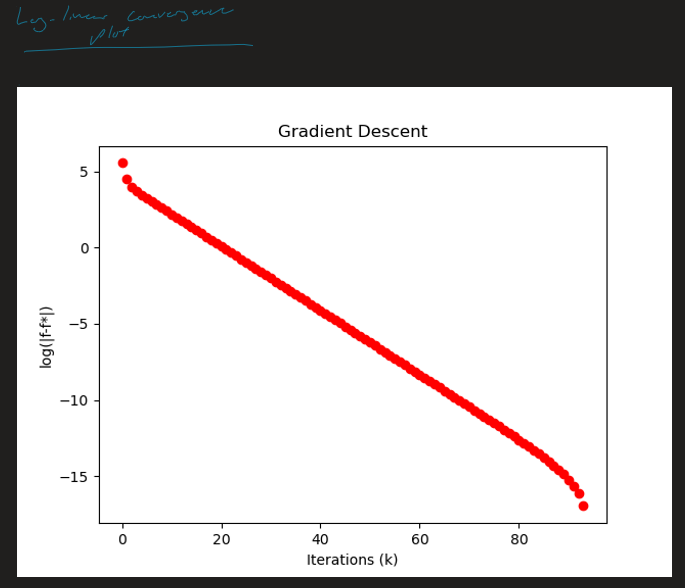
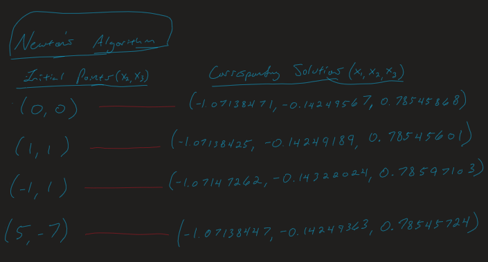
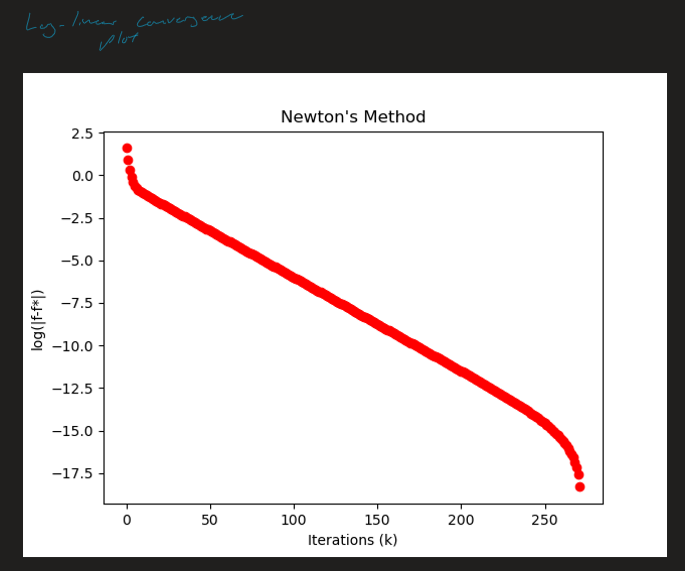

# **Homework II**

Author: Joseph D. Galloway II
Course: Design Optimization (ME 598)  
*[Google Colab Notebook](wwww.google.com)*

## Problem I
[Resource for Taylor Series](https://math.libretexts.org/Bookshelves/Calculus/Supplemental_Modules_(Calculus)/Multivariable_Calculus/3%3A_Topics_in_Partial_Derivatives/Taylor__Polynomials_of_Functions_of_Two_Variables)

## Problem II

## Problem III

## Problem IV

## Problem V

