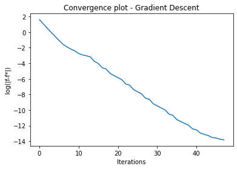
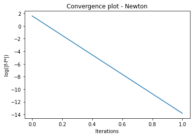

# Theory/Computation Problems

### Problem 1 (20 points) 
Show that the stationary point (zero gradient) of the function
$$
\begin{aligned}
    f=2x_{1}^{2} - 4x_1 x_2+ 1.5x^{2}_{2}+ x_2
\end{aligned}
$$
is a saddle (with indefinite Hessian). Find the directions of downslopes away from the saddle. Hint: Use Taylor's expansion at the saddle point. Find directions that reduce $f$.

### Problem 2 (50 points) 

* (10 points) Find the point in the plane $x_1+2x_2+3x_3=1$ in $\mathbb{R}^3$ that is nearest to the point $(-1,0,1)^T$. Is this a convex problem? Hint: Convert the problem into an unconstrained problem using $x_1+2x_2+3x_3=1$.

* (40 points) Implement the gradient descent and Newton's algorithm for solving the problem. Attach your codes along with a short summary including (1) the initial points tested, (2) corresponding solutions, (3) a log-linear convergence plot.

### Problem 3 (10 points) 
Let $f(x)$ and $g(x)$ be two convex functions defined on the convex set $\mathcal{X}$. 
* (5 points) Prove that $af(x)+bg(x)$ is convex for $a>0$ and $b>0$. 
* (5 points) In what conditions will $f(g(x))$ be convex?

### Problem 4 (bonus 10 points)
Show that $f({\bf x}_1) \geq f(\textbf{x}_0) + 
    \textbf{g}_{\textbf{x}_0}^T(\textbf{x}_1-\textbf{x}_0)$ for a convex function $f(\textbf{x}): \mathcal{X} \rightarrow \mathbb{R}$ and for $\textbf{x}_0$, $\textbf{x}_1 \in \mathcal{X}$. 

# Design Problems

### Problem 5 (20 points) 
Consider an illumination problem: There are $n$ lamps and $m$ mirrors fixed to the ground. The target reflection intensity level is $I_t$. The actual reflection intensity level on the $k$th mirror can be computed as $\textbf{a}_k^T \textbf{p}$, where $\textbf{a}_k$ is given by the distances between all lamps to the mirror, and $\textbf{p}:=[p_1,...,p_n]^T$ are the power output of the lamps. The objective is to keep the actual intensity levels as close to the target as possible by tuning the power output $\textbf{p}$.

* (5 points) Formulate this problem as an optimization problem. 
* (5 points) Is your problem convex?
* (5 points) If we require the overall power output of any of the $n$ lamps to be less than $p^*$, will the problem have a unique solution?
* (5 points) If we require no more than half of the lamps to be switched on, will the problem have a unique solution?

**Problem 1**

(i) $$f = 2x_{1}^{2} - 4x_1x_2 + 1.5x_2^2$$
The stationary point of the function is obtained by taking the gradient and setting it to zero: \
$ \rho = \begin{bmatrix}4x_1 - 4x_2 \\ -4x_1 + 3x_2 + 1 \end{bmatrix}$ = 0\
Solving for x_1 and x_2 gives a stationary point (1,1). \
Indefiniteness of the Hessian can be shown by computing its eigenvalues: \

$ H = \begin{bmatrix} 4 & -4 \\ -4 & -1 \end{bmatrix} $ \
$ \begin{vmatrix} 4 - \lambda & -4 \\ -4 & -1 - \lambda \end{vmatrix} = 0 $ \
$ \lambda_{1} = 10.54, \lambda_{2} = -4.54 $ \
Since the eigenvalues are both positive and negative, the Hessian is indefinite. \
To find the direction of the slopes awy from the saddle point (1,1) we need to find the points such that the difference f - f(1,1) < 0: \
$ f - f(1,1) = \frac{f_{x_1x_1}(1,1)(x_1 - 1)^2}{2} + \frac{f_{x_1x_2}(1,1)(x_1 - 1)(x_2 - 1)}{2} + \frac{f_{x_2x_2}(1,1)(x_2 - 1)^2}{2} $ \
$ f - 0.5 = 2(x_1 - 1)^2 - 2(x_1 - 1)(x_2 - 1) - 0.5(x_2 - 1)^2 < 0 $ \ 


**Problem 2** \
Part a: (Analytical)
The problem asks to find a point closest to (-1, 0, 1) such that it is constrained to lie on the plane $ x_1 + 2x_2 + 3x_3 = 1 $. \
The problem can be formulated as:
$ \underset{x}{\operatorname{argmin}} L(x_0, x) \\
 \text{st } x_1 + 2x_2 + 3x_3 = 1 $
\
Using Lagrange multipliers on the equality constraint: 
\
$ \underset{x}{\operatorname{argmin}} L(x, x_0) = (x_{01} - x_1)^2 + (x_{02} - x_2)^2 + (x_{03} - x_3)^2 = \lambda g(x) $ \
$ \nabla L(x) = \lambda \nabla g(x) $ \
$ g(x) = c $ \
The constraint equation works out to be: \
$ \nabla L(x) = \begin{bmatrix}2x_1 + 2 \\ 2x_2 \\ 2x_3 - 2 \end{bmatrix} = \begin{bmatrix} 0 \\ \lambda \\ 2\lambda \end{bmatrix} $ \
Together with the equation $ x_1 + 2x_2 + 3x_3 - 1 = 0 $, solving for the x's we get:\
$ x = \begin{bmatrix} -1 \\ \frac{-1}{8} \\ \frac{3}{4} \end{bmatrix} $ 


```python
# PROBLEM 2 : CODE FOR GRADIENT DESCENT
print("Gradient descent solution")
import numpy as np

def objective(x):
    return (2 - (2*x[0]) - (3*x[1]))**2 + (x[0])**2 + (x[1] - 1)**2

def grad(x):
    return np.asarray([10*x[0] + 12*x[1] - 8, 12*x[0] + 20*x[1] - 14])

def phi(a,x):
    obj = objective(x)
    corr = a*0.8*np.dot(grad(x), grad(x))
    return obj - corr

def line_search(x):
    a = 1  # initialize step size
    while np.linalg.norm(phi(a,x))<objective(x-a*grad(x)):  # if f(x+a*d)>phi(a) then backtrack. d is the search direction
        a = 0.5*a
    return a

eps = 1e-3
x0 = [0,0]
k = 0
x = x0
soln = [objective(x)]

error = np.linalg.norm(grad(x))

while error >= eps and k < 10000:  # keep searching while gradient norm is larger than eps
    a = line_search(x)
    x = x - a*grad(x)
    error = np.linalg.norm(grad(x))
    soln.append(objective(x))
    k+=1
    if k % 1000 == 0: print("Iteration:", k, "alpha:", a, "Error:", error, "x:", x)

import matplotlib.pyplot as plt
y = [np.log(np.linalg.norm(s - objective(x) + 1e-6)) for s in soln]
fig = plt.figure()
plt.plot(y)
plt.xlabel('Iterations')
plt.ylabel('log(|f-f*|)')
plt.title('Convergence plot - Gradient Descent')
x1 = 1 - 2*x[0] - 3*x[1]
x = [x1, x[0], x[1]]
print("Final solution:", x)

###########################################
# Problem 2: Newton's method
print("Newton's method solution: ")
import numpy as np

def objective(x):
    return (2 - (2*x[0]) - (3*x[1]))**2 + (x[0])**2 + (x[1] - 1)**2

def grad(x):
    return np.asarray([10*x[0] + 12*x[1] - 8, 12*x[0] + 20*x[1] - 14])

def hessian():
    return np.asarray([[10,12],[12,20]])

def phi(a,x):
    obj = objective(x)
    corr = a*0.8*np.matmul(np.matmul(grad(x).reshape(1,2),np.linalg.inv(hessian())), grad(x).reshape(2,1))
    return obj - corr

def line_search(x):
    a = 1  # initialize step size
    while phi(a,x)<objective(x-a*grad(x)):  # if f(x+a*d)>phi(a) then backtrack. d is the search direction
        a = 0.5*a
    return a

eps = 1e-3
x0 = [0,0]
k = 0
x = np.asarray(x0).reshape(2,1)
soln = [objective(x)]

lam = np.matmul(np.matmul(grad(x).reshape(1,2),np.linalg.inv(hessian())), grad(x).reshape(2,1))
while lam**2/2 >= eps and k < 10000:  # keep searching while gradient norm is larger than eps
    a = line_search(x)
    a = 1
    x = x - a*np.matmul(np.linalg.inv(hessian()), grad(x).reshape(2,1))
    soln.append(objective(x))
    lam = np.matmul(np.matmul(grad(x).reshape(1,2),np.linalg.inv(hessian())), grad(x).reshape(2,1))
    k+=1
    if k % 1 == 0: print("Iteration:", k, "alpha:", a, "Error:", error, "x:", x)

import matplotlib.pyplot as plt
fig = plt.figure()

y = [np.log(np.linalg.norm(s - objective(x) + 1e-6)) for s in soln]
plt.plot(y)
plt.xlabel('Iterations')
plt.ylabel('log(|f-f*|)')
plt.title('Convergence plot - Newton')

x1 = 1 - 2*x[0] - 3*x[1]
x = [x1, x[0], x[1]]
print("Final solution:", x)


```

    Gradient descent solution
    Final solution: [-1.0713988626792919, -0.14249520055213166, 0.7854630879278517]
    Newton's method solution: 
    Iteration: 1 alpha: 1 Error: 0.000910695792946387 x: [[-0.14285714]
     [ 0.78571429]]
    Final solution: [array([-1.07142857]), array([-0.14285714]), array([0.78571429])]


    

    


    

    


**Problem 3** \
(i) Let f(x) and g(x) be two convex functions defined on the convex set X. 
The linear combination h(x) is defined as: \
$ h(x) = af(x) + bg(x) $
If f(x) and g(x) are convex then: \
$ f(\lambda x_1 + (1- \lambda)x_2) \le \lambda f(x_1) + (1 - \lambda)f(x_2) $ \
$ g(\lambda x_1 + (1- \lambda)x_2) \le \lambda g(x_1) + (1 - \lambda)g(x_2) $ \
$ af(\lambda x_1 + (1- \lambda)x_2) + bg(\lambda x_1 + (1- \lambda)x_2) \le a(\lambda f(x_1) + (1 - \lambda)f(x_2)) + b(\lambda g(x_1) + (1 - \lambda)g(x_2)) $ \
The right side can be rewritten as: \
$ \lambda(af(x_1) + bg(x_1)) + (1-\lambda)(af(x_2) + bg(x_2)) $ \
From the definition of h(x), the right hand side can be transformed to: \
$ \lambda h(x_1) + (1-\lambda)h(x_2) $ \
$ \square $ \
(ii) Conditions for convexity of a composition of two convex functions f and g: \


**Problem 5** \
(i) Formulation of optimization problem:
$ \underset{p_j}{\operatorname{min}} \sum_{k = 1}^{n} (I_k - I_t)^2 $ \
st $ 0 \le p_j \le p_{max}$ \
(ii) A formulation is convex if the objective is a convex function and the constraints have a feasible set that is convex. 
Consider the function: $ f(p) = (a_k^Tp - I)^2 $ \
$ \nabla f = 2a_ka_k^Tp - 2Ia_k $ \
$ \nabla ^2 f = 2a_ka_k^T $ \
Lemma: If $ d^THd \ge 0 \text{ for all d} \ne 0 \text{ then H is positive semi definite.} $ \
In this case, applying the lemma gives us  $ d^THd = 2d^Ta_ka_k^Td $, which is always non negative. 
Moreover, the summation of k convex functions is also convex. Therefore the objective is convex. The feasible set from the constraints is convex because they form a segmented space that is a hypercube. \
(iii) If we require the power output of any of the n lamps to be less than p*, the modified optimization problem is: \
$ \underset{p_j}{\operatorname{min}} \sum_{k = 1}^{n} (I_k - I_t)^2 $ \
st $ 0 \le p_j \le p_{max}$ , \
$ \sum_{j = 1}^{k} p_j < p^*,  k = {1,...,n}$ \
The second constraint can be further split into n separate constraints. Unique solutions are possible if all the constraints are convex sets. Consider the constraint $ \sum_{j = 1}^{l} p_j \lt p^* , l \epsilon k $. The summation produces an l-dimensional half space of a hyperplane, which is a convex set. Therefore the problem has a unique solution. \
(iv) If only half the lamps can be on at the same time, then the problem has a combinatorial constraint, where out of n lamps, any n/2 of them can be switched on. The constraint to be added to the formulation is:
$ \underset{p_j}{\operatorname{min}} \sum_{k = 1}^{n} (I_k - I_t)^2 $ \
st $ 0 \le p_j \le p_{max}$ , \
$ ||x||_0 \le \frac{n}{2} $ \
The l-0 norm is not convex, therefore the problem does not have a unique solution.

