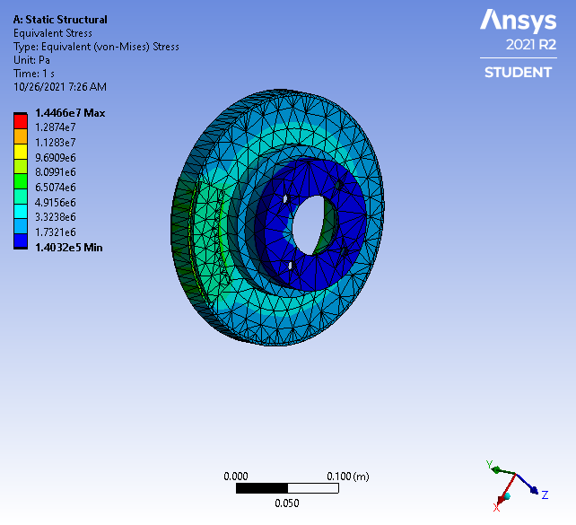
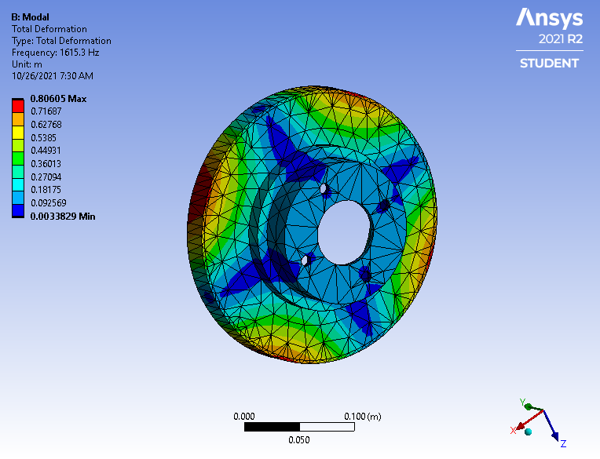
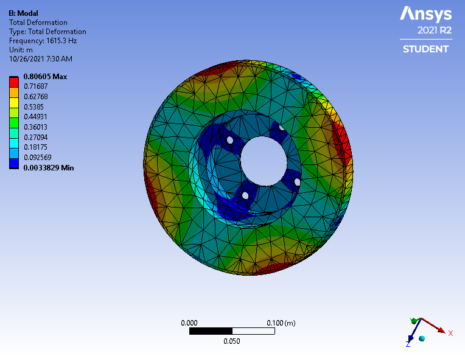
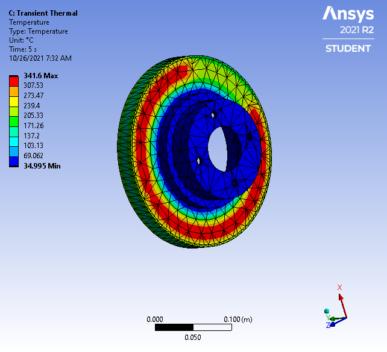
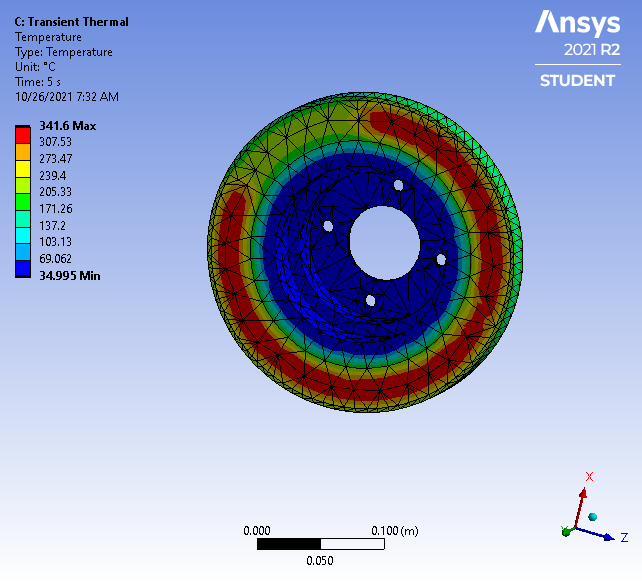

# **Project II**

Author: Joseph D. Galloway II  
Course: Design Optimization (ME 598)

# Results
Initial Design

Final Design

# Analysis
What are your design variables, constraints, and objectives?

What are the potential trade-offs between your objectives?

Are your variables continuous? Or are they discrete/integer?

Do you have analytical objective/constraint functions? And are they differentiable?

Based on the above answers, what optimization methods will you choose?

Perform a sensitivity analysis and comment on the importance of your variables? Also, do you observe monotonicity (i.e., the objective always goes up or down with a variable)?
